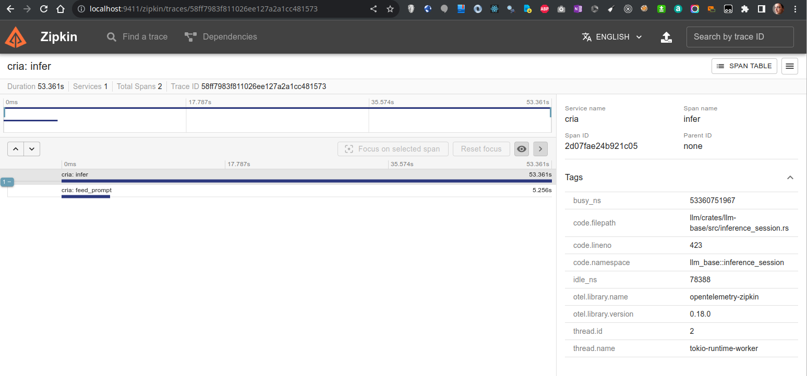

# Cria - Local llama OpenAI-compatible API

The objective is to serve a local `llama-2` model by mimicking an OpenAI API service.
The llama2 model **runs on GPU** using `ggml-sys` crate with specific compilation flags.

## Get started:

### Using Docker (recommended way)

The easiest way of getting started is using the official Docker container. Make sure you have `docker` and `docker-compose` installed on your machine (example install for [ubuntu20.04](https://www.digitalocean.com/community/tutorials/how-to-install-and-use-docker-compose-on-ubuntu-20-04)).

`cria` provides two docker images : one for CPU only deployments and a second GPU accelerated image. To use GPU image, you need to install the [NVIDIA Container Toolkit](https://docs.nvidia.com/datacenter/cloud-native/container-toolkit/latest/install-guide.html). We also recommend using NVIDIA drivers with CUDA version 11.7 or higher.

To deploy the `cria` gpu version using `docker-compose`:

1. Clone the repos:

```bash
git clone git@github.com:AmineDiro/cria.git
cd cria/docker
```

2. The api will load the model located in `/app/model.bin` by default. You should change the docker-compose file with ggml model path for docker to bind mount. You can also change environement variables for your specific config. Alternatively, the easiest way is to set `CRIA_MODEL_PATH` in a`docker/.env` :

```bash
# .env
CRIA_MODEL_PATH=/path/to/ggml/model

# Other environement variables to set
CRIA_SERVICE_NAME=cria
CRIA_HOST=0.0.0.0
CRIA_PORT=3000
CRIA_MODEL_ARCHITECTURE=llama
CRIA_USE_GPU=true
CRIA_GPU_LAYERS=32
CRIA_ZIPKIN_ENDPOINT=http://zipkin-server:9411/api/v2/spans
```

3. Run `docker-compose` to startup the `cria` API server and the zipkin server

```bash
docker compose up -f docker-compose-gpu.yaml -d
```

4. Enjoy using your local LLM API server 🤟 !

### Local Install

1. Git clone project

   ```bash
   git clone git@github.com:AmineDiro/cria.git
   cd cria/
   ```

2. Build project ( I ❤️ cargo !).

   ```bash
   cargo b --release
   ```

   - For `cuBLAS` (nvidia GPU ) acceleration use
     ```bash
     cargo b --release --features cublas
     ```
   - For `metal` acceleration use
     ```bash
     cargo b --release --features metal
     ```
     > ❗ NOTE: If you have issues building for GPU, checkout the building issues section

3. Download GGML `.bin` LLama-2 quantized model (for example [llama-2-7b](https://huggingface.co/TheBloke/Llama-2-7B-GGML/tree/main))
4. Run API, use the `use-gpu` flag to offload model layers to your GPU
   ```bash
   ./target/cria -a llama --model {MODEL_BIN_PATH} --use-gpu --gpu-layers 32
   ```

## Command line arguments reference

All the parameters can be passed as environment variables or command line arguments. Here is the reference for the command line arguments:

```bash
./target/cria --help

Usage: cria [OPTIONS]

Options:
  -a, --model-architecture <MODEL_ARCHITECTURE>      [default: llama]
      --model <MODEL_PATH>
  -v, --tokenizer-path <TOKENIZER_PATH>
  -r, --tokenizer-repository <TOKENIZER_REPOSITORY>
  -H, --host <HOST>                                  [default: 0.0.0.0]
  -p, --port <PORT>                                  [default: 3000]
  -m, --prefer-mmap
  -c, --context-size <CONTEXT_SIZE>                  [default: 2048]
  -l, --lora-adapters <LORA_ADAPTERS>
  -u, --use-gpu
  -g, --gpu-layers <GPU_LAYERS>
  --n-gqa <N_GQA>
      Grouped Query attention : Specify -gqa 8 for 70B models to work
  -z, --zipkin-endpoint <ZIPKIN_ENDPOINT>
  -h, --help                                         Print help
```

For environment variables, just prefix the argument with `CRIA_` and use uppercase letters. For example, to set the model path, you can use `CRIA_MODEL` environment variable.

There is a an example `docker/.env.sample` file in the project root directory.

# Prometheus Metrics

We are exporting Prometheus metrics via the `/metrics` endpoint.

# Tracing

We are tracing performance metrics using `tracing` and `tracing-opentelemetry` crates.

You can use the `--zipkin-endpoint` to export metrics to a zipkin endpoint.

There is a docker-compose file in the project root directory to run a local zipkin server on port `9411`.

<div align="center">

</div>

# Completion Example

You can use `openai` python client or directly use the `sseclient` python library and stream messages.
Here is an example :

<details><summary>Here is a example using a Python client</summary>

```python
import json
import sys
import time

import sseclient
import urllib3

url = "http://localhost:3000/v1/completions"


http = urllib3.PoolManager()
response = http.request(
    "POST",
    url,
    preload_content=False,
    headers={
        "Content-Type": "application/json",
    },
    body=json.dumps(
        {
            "prompt": "Morocco is a beautiful country situated in north africa.",
            "temperature": 0.1,
        }
    ),
)

client = sseclient.SSEClient(response)

s = time.perf_counter()
for event in client.events():
    chunk = json.loads(event.data)
    sys.stdout.write(chunk["choices"][0]["text"])
    sys.stdout.flush()
e = time.perf_counter()

print(f"\nGeneration from completion took {e-s:.2f} !")

```

</details>

You can clearly see generation using my M1 GPU:

<p align="center">

</p>

## TODO/ Roadmap:

- [x] Run Llama.cpp on CPU using llm-chain
- [x] Run Llama.cpp on GPU using llm-chain
- [x] Implement `/models` route
- [x] Implement basic `/completions` route
- [x] Implement streaming completions SSE
- [x] Cleanup cargo features with llm
- [x] Support MacOS Metal
- [x] Merge completions / completion_streaming routes in same endpoint
- [x] Implement `/embeddings` route
- [x] Implement route `/chat/completions`
- [x] Setup good tracing
- [x] Docker deployment on CPUs / GPU
- [x] Metrics : Prometheus
- [x] Implement a global request queue
  - [x] For each response put an entry in a queue
  - [x] Spawn a model in separate task reading from ringbuffer, get entry and put each token in response
  - [x] Construct stream from flume resp_rx chan and stream responses to user.
- [ ] BETTER ERRORS and http responses (deal with all the unwrapping)
- [ ] Implement streaming chat completions SSE
- [ ] Implement request batching
- [ ] Implement request continuous batching
- [ ] Setup CI/CD
- [ ] _Maybe_ Support huggingface `candle` lib for a full rust integration

## API routes

Details on OpenAI API docs: https://platform.openai.com/docs/api-reference/
